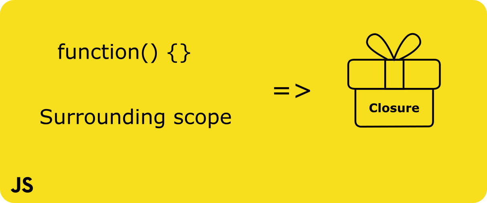
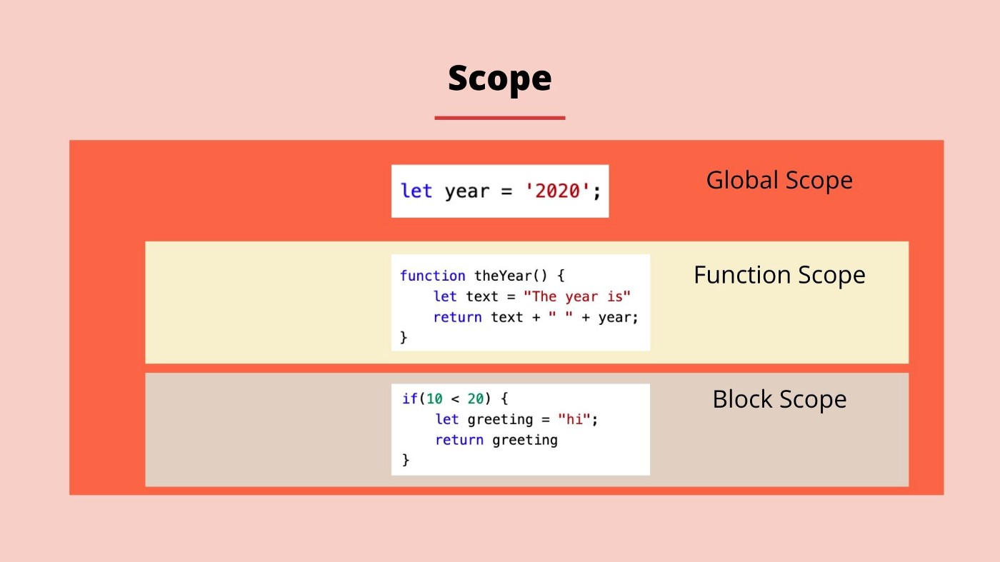
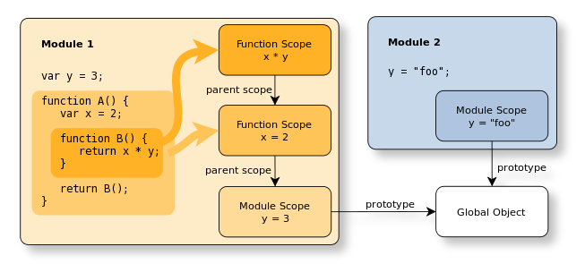
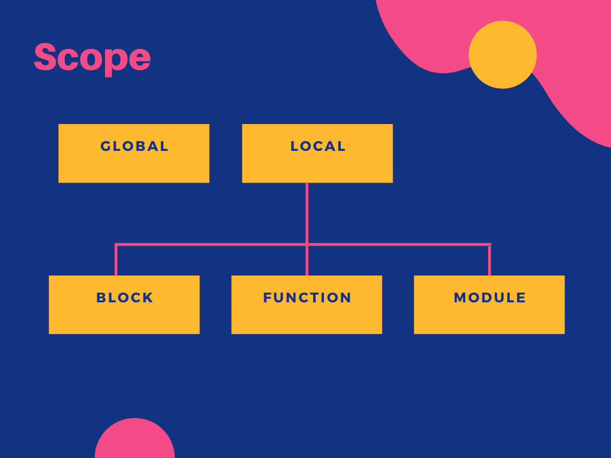
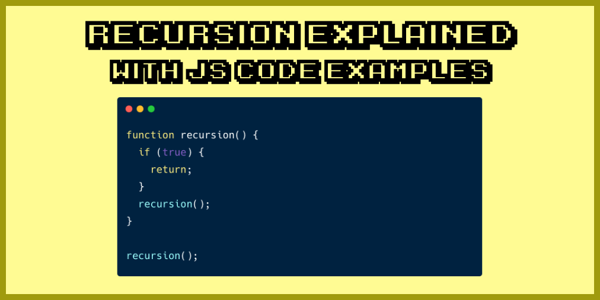
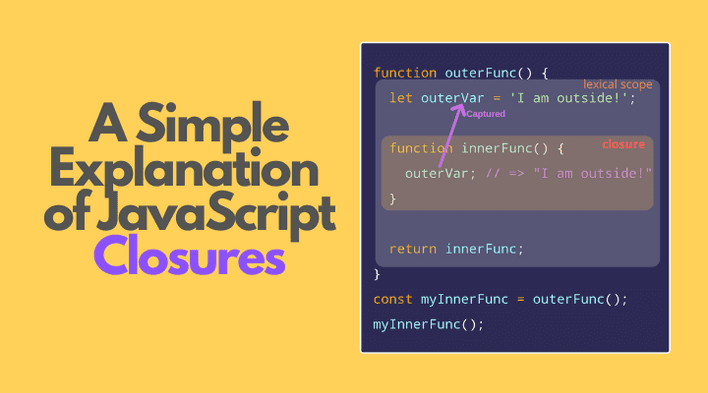

# Table of Contents
- #### Functions
- #### Scope
- #### Hoisting
- #### Recursion and Closure

# Funtion-Declaration
- ##### A function is declared using the function keyword.
- ##### The basic rules of naming a function are similar to naming variables. It is better to write a descriptive name for your function
- ##### The body of function is written within {}.

# Funtion-Declaration
- ###### Variable x is used to store the function. Here the function is treated as an expression. And the function is called using the variable name.
- ##### The function is called anonymous function.
# Scope
#### The building represent program's nested scope ruleset.The first floor of the building represents your currently executing scope, wherever you are. The top level of the building is the global scope . 

# Scope - Lexical Scope
#### Lexical scope is scope that is defined at lexing time. In other words, lexical scope is based on where variables and blocks of scope are authored, by you, at write time , and thus is (mostly) set in stone by the time the lexer processes your code.

# Scope - Global Scope
#### A variable declared at the top of a program or outside of a function is considered a global scope variable. 

# Scope - Local Scope
#### The building represent program's nested scope ruleset.The first floor of the building represents your currently executing scope, wherever you are. The top level of the building is the global scope . 

# Hoisting - Variables
##### There is a temptation to think that all of the code you see in a JavaScript
##### program is interpreted line-by-line, top-down in order, as the program execute
##### While that is essentially true, there's one part of that as-
##### assumption that can lead to incorrect thinking about your program. 

# Hoisting - Function Declaration 
##### So, one wat of thinking, sort of metaphorically , about this process is, that variables and function declarations are "moved" from where they appear in the flow of the code to the top of the code . This gives rise to the name 

# Hoisting - Function Expression 
##### Function declarations are hoisted, as we just saw, But function expressions are not.

# Recursion
##### 1 .  Recursion is a process of calling itself. A function that calls itself is called a recursive function:
##### 2.  A recursive function must have a condition to stop calling itself. Otherwise, the function is called idefinitely.
##### 3. Once the condition is met, the function stops calling itself. This is called the base condition.
##### 4. Prevent infinite recursion, you can use if ... else statement (or similar approach) where one branch maked the recursive call, and the other doesn't.

# Closure
#### Closure is one of the most important , and often least understood, concepts in JavaScript. You can think of closure as a way to "remember" and continue to access a function's scope (its variables) even once the function has finished running

